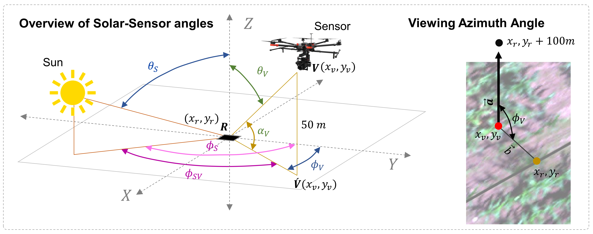

[![Stargazers][stars-shield]][stars-url]
[![Forks][forks-shield]][forks-url]
[![Issues][issues-shield]][issues-url]
[![MIT License][license-shield]][license-url]

# UAV Solar-Sensor Angle Calculation

<!-- PROJECT LOGO -->
 

  

<!-- TABLE OF CONTENTS -->

  
Table of Contents

  <ol>
    <li>
      <a href="#about-the-project">About The Project</a>
      <ul>
        <li><a href="#built-with">Built With</a></li>
      </ul>
    </li>
    <li>
      <a href="#getting-started">Getting Started</a>
      <ul>
        <li><a href="#prerequisites">Prerequisites</a></li>
        <li><a href="#installation">Installation</a></li>
        <li><a href="#datasets">Datasets</a></li>
      </ul>
    </li>
    <li><a href="#contributing">Contributing</a></li>
    <li><a href="#license">License</a></li>
    <li><a href="#contact">Contact</a></li>
    <li><a href="#acknowledgments">Acknowledgments</a></li>
  </ol>

<!-- ABOUT THE PROJECT -->
## About The Project

There are many great README templates available on GitHub; however, I didn't find one that really suited my needs so I created this enhanced one. I want to create a README template so amazing that it'll be the last one you ever need -- I think this is it.

Here's why:
* Your time should be focused on creating something amazing. A project that solves a problem and helps others
* You shouldn't be doing the same tasks over and over like creating a README from scratch
* You should implement DRY principles to the rest of your life :smile:

Of course, no one template will serve all projects since your needs may be different. So I'll be adding more in the near future. You may also suggest changes by forking this repo and creating a pull request or opening an issue. Thanks to all the people have contributed to expanding this template!

Use the `BLANK_README.md` to get started.

(<a href="#top">back to top</a>)

### Built With

The project is built with many open source Python packages. However, following libraries are the backbone of the project:

* [pvlib](https://pvlib-python.readthedocs.io/en/stable/)
* [GDAL](https://gdal.org/)
* [GeoPandas](https://geopandas.org/en/stable/)
* [Pandas](https://pandas.pydata.org/)
* [Scipy](https://scipy.org/)

(<a href="#top">back to top</a>)

<!-- GETTING STARTED -->
## Getting Started

To get a local copy up and running follow these simple example steps.

### Prerequisites

For this project, `anaconda` is suggested. Create a virtual environment in `anaconda` using `Python 3x`.

### Set up the notebooks

1. Create a separate environment in `conda`.
2. Install all the packages required using either `pip` or `conda`.
3. Clone the repo
4. Open the notebooks in the `notebooks` folder. Use the two notebooks chronologically.

### Datasets
The dataset provided for testing the codes is provided in Google Drive. Please follow this [link](https://drive.google.com/drive/folders/1rThYam61vmjUb0zvftqG6wvp1SsbTJpq?usp=sharing) to download the dataset and then place it in the data folder of your repository. The folder contains a HSI cube and the IMU_GPS data in txt format.

(<a href="#top">back to top</a>)

<!-- CONTRIBUTING -->
## Contributing

If you have a suggestion that would make this better, please fork the repo and create a pull request. You can also simply open an issue with the tag "enhancement".
Don't forget to give the project a star! Thanks again!

1. Fork the Project
2. Create your Feature Branch (`git checkout -b feature/AmazingFeature`)
3. Commit your Changes (`git commit -m 'Add some AmazingFeature'`)
4. Push to the Branch (`git push origin feature/AmazingFeature`)
5. Open a Pull Request

(<a href="#top">back to top</a>)

<!-- LICENSE -->
## License

Distributed under the MIT License. See `LICENSE.txt` for more information.

(<a href="#top">back to top</a>)

<!-- CONTACT -->
## Contact

(<a href="#top">back to top</a>)

<!-- ACKNOWLEDGMENTS -->
## Acknowledgments

* [Solar Sena](https://solarsena.com/)
* [pvlib](https://pvlib-python.readthedocs.io/en/stable/)

(<a href="#top">back to top</a>)

<!-- MARKDOWN LINKS & IMAGES -->
[stars-shield]: https://img.shields.io/github/stars/othneildrew/Best-README-Template.svg?style=for-the-badge
[stars-url]: https://github.com/souravbhadra/uav-solar-sensor-angle/stargazers
[forks-shield]: https://img.shields.io/github/forks/othneildrew/Best-README-Template.svg?style=for-the-badge
[forks-url]: https://github.com/souravbhadra/uav-solar-sensor-angle/network/members
[issues-shield]: https://img.shields.io/github/issues/othneildrew/Best-README-Template.svg?style=for-the-badge
[issues-url]: https://github.com/souravbhadra/uav-solar-sensor-angle/issues
[license-shield]: https://img.shields.io/github/license/othneildrew/Best-README-Template.svg?style=for-the-badge
[license-url]: https://github.com/souravbhadra/uav-solar-sensor-angle/blob/master/LICENSE.txt
